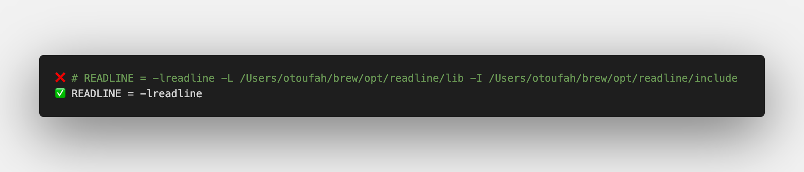
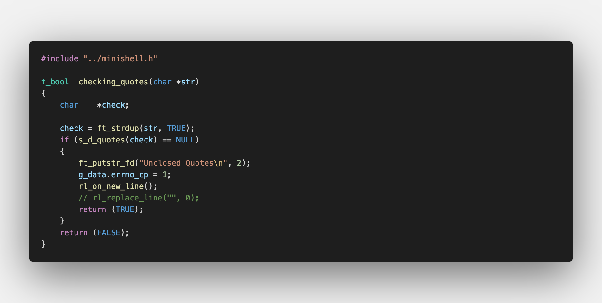
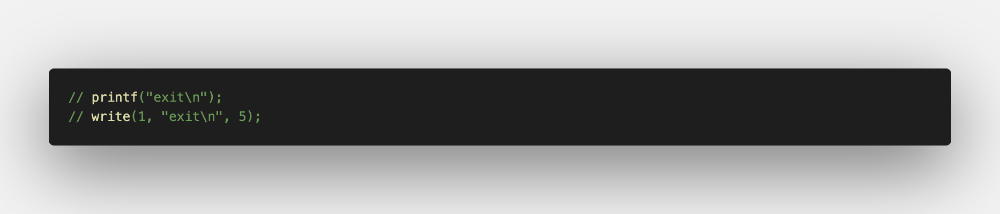
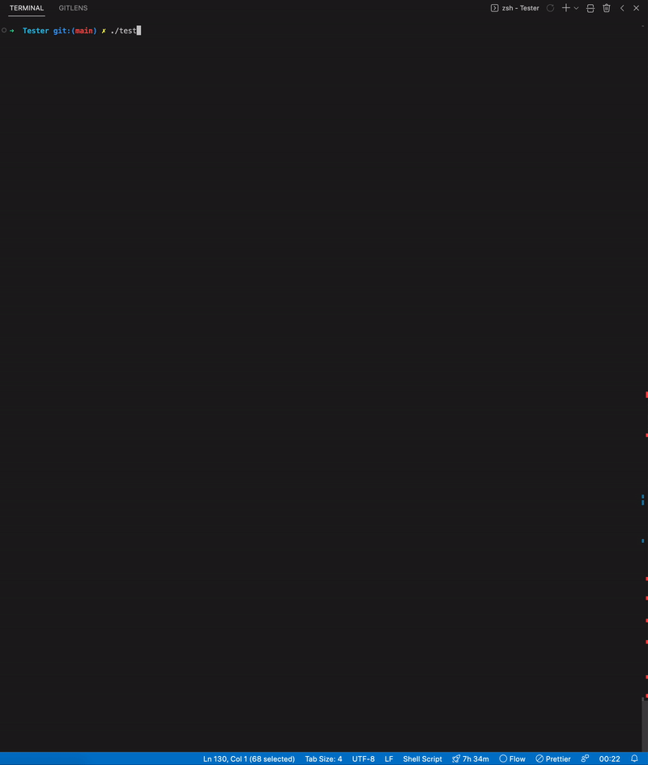

# Minishell_Tester

A simple Minishell tester

How To Use a Minishell_Tester : 

:one: Go to your Makefile and make sure to not insert any flags for readline only -lreadline :




:two: Check if there's any rl_replace_line and make sure to comment it :



:three: If you print any of thoses please comment them and that's it:




# Install :

```
git clone https://github.com/Toufa7/Minishell_Tester.git
cd Minishell_Tester
chmod +x tester.sh
./tester.sh -options
```

# Synopsis :

./Tester [-h|E|p|x|e]

 The following options are available:
 
- -h        Help
- -E        Echo
- -p        Pipes
- -x        Exit
- -e        Export


# A quick demonstration of how it works




## Special Thanks ✨

Thanks goes to these wonderful people :

<table>
  <tr>
    <td align="center"><a href="https://github.com/Toufa7"><br /><sub><b>P0MS</b>
    <td align="center"><a href="https://github.com/YassineEddyb"><br /><sub><b>Oshen</b>
    <td align="center"><a href="https://github.com/Abdeljalil-Bouchfar"><br /><sub><b>Bouchfa</b></sub></a><br /><a href="" title=""></a></td>


feel free to use it and modify it 🤝
