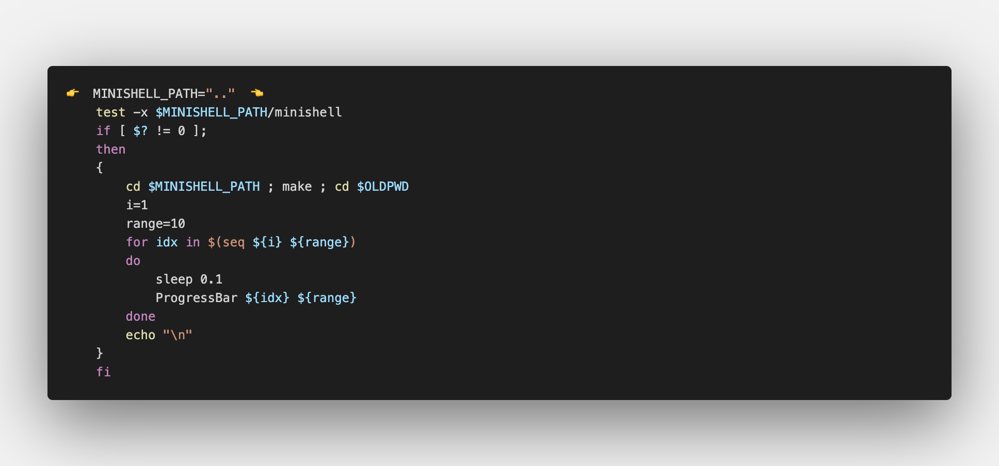

# Minishell_Tester

A simple Minishell tester, it checks your output and your exit status are similar to the bash or not also it checks it compare your return errors else it returns where's your wrong see :

    ./tester.sh --help


$$\textcolor{Green}{\text{[OK]  }}{\text{Means that your output and the exit status are similar to the bash}}\textcolor{yellow}{\text{}}$$

$$\textcolor{Red}{\text{[KO]  }}{\text{Means one of your output or the exit status or both are wrong to the bash}}\textcolor{yellow}{\text{}}$$


How To Use a Minishell_Tester : 

:one: Go to your Makefile and make sure to not insert any flags for readline only -lreadline :


:two: Check if there's any rl_replace_line and make sure to comment it :


:three: If you print any of thoses please comment them and that's it:


:four: Put your path in here:




# Install :

```
git clone https://github.com/Toufa7/Minishell_Tester.git
cd Minishell_Tester
chmod +x tester.sh
./tester.sh -options
```

# Synopsis :

./Tester [-h|E|p|x|e]

 The following options are available:
 
- -h        Help
- -E        Echo
- -p        Pipes
- -x        Exit
- -e        Export


# A quick demonstration of how it works


## Thanks ✨

Thanks goes to these people :

<table>
  <tr>
    <td align="center"><a href="https://github.com/YassineEddyb"><br /><sub><b>Oshen</b>
  </tr>
</table>


feel free to use it and modify it 🤝
